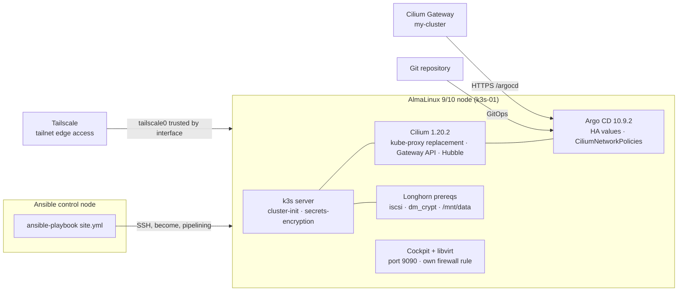

# infra-ansible-k3s


**Build a small, production-shaped Kubernetes cluster from a clean AlmaLinux host with one
`ansible-playbook` run — kube-proxy-free networking with Cilium, GitOps from day zero with
Argo CD, storage prerequisites for Longhorn, and hybrid edge access over Tailscale.**

This repository is the whole story: the playbooks that build the cluster, the Helm values
that define it, and — in [`docs/`](docs/) — the *why* behind every non-obvious decision.

---

## Why this exists

Rebuilding a homelab or edge cluster by hand is where drift starts: copy-pasted flags, a
flannel plugin nobody chose on purpose, a token someone pasted into a chat, firewall holes
"temporary" since 2023. The upstream [k3s-ansible](https://github.com/k3s-io/k3s-ansible)
kickstart is solid, but it ships defaults this cluster does not want:

| Upstream default | This repo's answer | Why |
| --- | --- | --- |
| flannel + kube-proxy | **Cilium** with `kubeProxyReplacement` | One dataplane for routing, policy, load-balancing and observability; no iptables churn |
| Network policies enabled via kube-proxy | Cilium L7-aware policies + explicit `CiliumNetworkPolicy` | Strict default-deny that still lets Tailscale and the apiserver through |
| Traefik | Disabled; **Gateway API** via Cilium | Standard `GatewayClass`/`Gateway` instead of a vendor ingress |
| Token ceremony between server and agents | **No token handling at all** | k3s generates and propagates it; nothing secret in git or shell history |
| Script-y Helm installs | **values-driven `kubernetes.core.helm`** with pinned `helm-diff` | Idempotent runs — `changed_when` is honest, re-runs converge |

Everything here is idempotent by design: run it twice, get the same cluster and a truthful
"changed" report the second time.

## Architecture at a glance



**The stack in one line:** k3s (server + agents) → Cilium (networking, policy, Gateway
API, Hubble) → Argo CD (GitOps) → Longhorn storage layer (prerequisites managed here,
the Helm release itself is GitOps-managed).

## What's inside

```
site.yml                  # 3 imports: base → k3s → virtualization (plays live in plays/)
plays/                    # one play per function: base.yml, k3s.yml, virtualization.yml
inventory/hosts.yml       # server/agent groups, hypervisors, Tailscale-backed ansible_host
inventory/group_vars/     # every tunable: k3s version, CIDRs, data paths, firewall switch
values/                   # single source of truth for both Helm charts
  cilium/values.yaml      # + values-dev.yaml overlay reference
  argocd/values.yaml      # + values-dev.yaml single-node overlay
roles/
  base/                   # AlmaLinux baseline: assert, curl/tar/git, chrony, facts, common firewall
  k3s_prereqs/            # k3s payload: Helm + helm-diff, kernel-modules-extra, socat, k3s firewall
  kernel_modules/         # br_netfilter, overlay, sysctls, reboot-required detection
  cockpit/                # cockpit + libvirt sockets, storage pool, SELinux fcontext, own 9090 rule
  cilium/                 # Gateway API CRDs → Cilium chart → accept_local fix
  longhorn_prereqs/       # iscsi/dm_crypt modules, filesystem assert, fail-loud checks
  argocd/                 # Argo CD chart, Lua health checks, CiliumNetworkPolicies
```

Firewall is per-role on purpose: `base` owns only the common rules (daemon,
Tailscale, masquerade); `k3s_prereqs` and `cockpit` open exactly what they
need — a future docker-only node gets `base` and zero k3s packages.

Each role is small, defaults-driven, and fail-loud: missing prerequisites assert with an
actionable message instead of letting the cluster come up half-broken. Full role reference
in [`docs/roles.md`](docs/roles.md).

## Quickstart

**Requirements:** an Ansible control node with `ansible-core >= 2.15` and a clean
AlmaLinux 9 or 10 host you can reach over SSH.

```bash
ansible-galaxy collection install -r requirements.yml   # k3s-orchestration pinned at tag 1.2.2
$EDITOR inventory/hosts.yml                              # point ansible_host at your node
ansible-playbook site.yml --syntax-check                 # sanity before the real run
ansible-playbook site.yml                                # baseline → k3s → Cilium → GitOps
```

Useful checks:

```bash
ansible-lint                                             # production profile (configured in .ansible-lint)
ansible-playbook site.yml --check --diff                 # see what would change
```

Idempotency is a feature, not an accident — the second run should report almost nothing
changed. The playbook reboots nothing by itself; when kernel modules are missing for the
running kernel, roles **report** `reboot required` and stop short of silently continuing.

## Design decisions

The short version of the arguments behind the architecture (longer reasoning lives in
[`docs/architecture.md`](docs/architecture.md)):

| Decision | Trade-off I accepted | Why it wins here |
| --- | --- | --- |
| Cilium over flannel/kube-proxy | Another moving part; `k8sServiceHost` must be a routable node IP, not `127.0.0.1` | Single dataplane, Gateway API, Hubble UI, L7 policy — and one upstream workaround (`accept_local`) instead of three plugins |
| `flannel-backend: none` + `disable-kube-proxy: true` | No built-in fallback path | Two overlays fighting over packets is a debugging nightmare; Cilium owns L3 |
| Gateway API CRDs applied **before** the chart, `--force-conflicts` | An extra pre-step | Cilium's `gatewayAPI.enabled` fails on missing CRDs; server-side apply keeps re-runs convergent |
| Tailscale trusted **by interface** (`tailscale0`), not by whole `100.64.0.0/10` | Trust lives at the interface level | Tailnet IPs churn; the interface identity does not. Pod CIDRs stay as sources because `lxc*` interfaces are ephemeral |
| No token ceremony | Relies on k3s internal token handling | k3s already generates and propagates tokens; hand-carrying them leaked secrets into shells and git |
| Helm via `kubernetes.core.helm` + pinned `helm-diff` `3.15.15` | Pin to maintain | Without the pinned plugin, upstream drift breaks idempotent `changed_when` detection |
| NetworkPolicies **on** for Argo CD + explicit `CiliumNetworkPolicy` allows | More YAML | Cilium runs strict mode by default — implicit deny would silently cut Tailscale access to the UI |
| `server.insecure: true` behind the Cilium Gateway | TLS terminates at the Gateway | Matches Tailscale HTTPS (`https://…ts.net/argocd/`); no cert rotation inside the cluster |
| Cockpit asserted, never installed | Host must provide it | The role manages *exposure and libvirt*, not your package policy — asserting beats silently installing |
| Fail-loud asserts everywhere (`lsmod`, `findmnt`, sockets, kubeconfig) | Playbook stops instead of continuing | A half-configured node is worse than a clear error naming the fix |

## Documentation

| Doc | What it answers |
| --- | --- |
| [`docs/architecture.md`](docs/architecture.md) | Topology, network planes, GitOps model, the decision log with trade-offs |
| [`docs/roles.md`](docs/roles.md) | Every role: inputs, tasks, asserts, outputs |
| [`docs/runbook.md`](docs/runbook.md) | Day-2: re-runs, upgrades, common failures, verification commands |

## Status

This repo is **living**: versions are pinned deliberately, decisions are recorded in the
commit history and in `docs/`, and overlays (`values-dev.yaml`) show the single-node
profile next to the HA profile. CI runs `ansible-lint` + `ansible-playbook --syntax-check`
on every push and pull request, and Renovate keeps collections, charts, and CI actions up
to date — the rest of the verification story (idempotent re-runs) is documented in the runbook.

## License

[MIT](LICENSE) © 2026 Seom88
